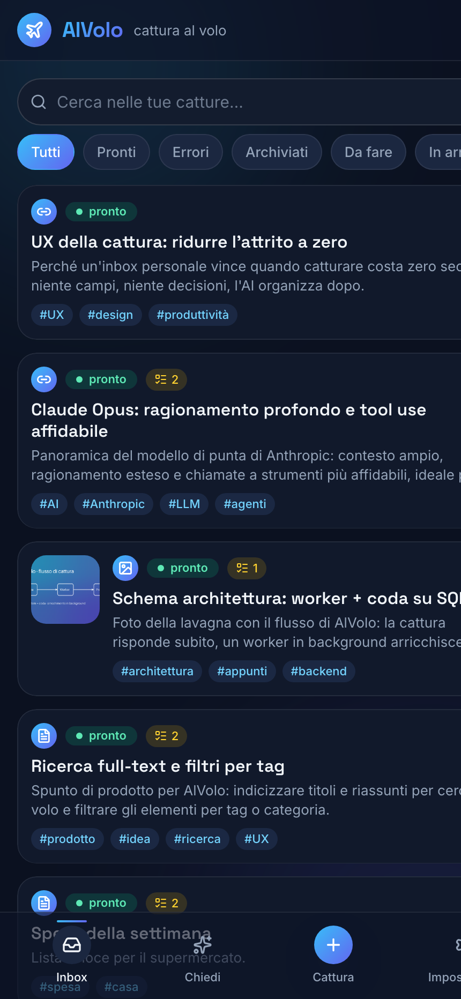
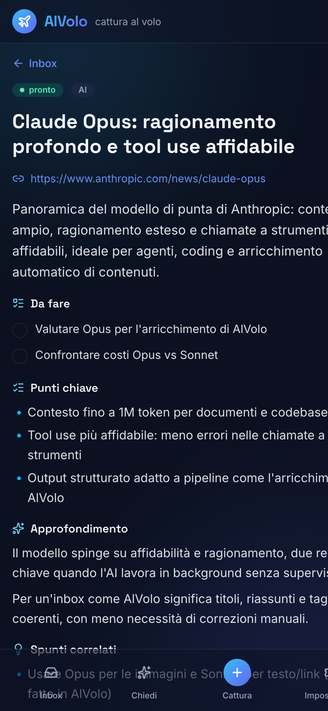
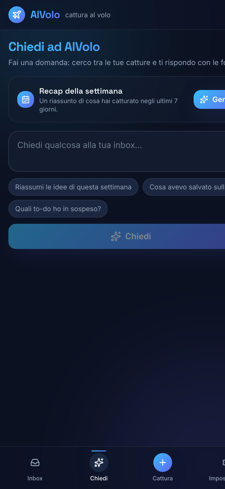
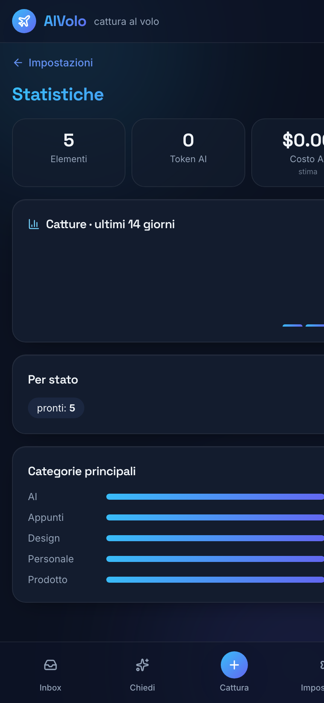
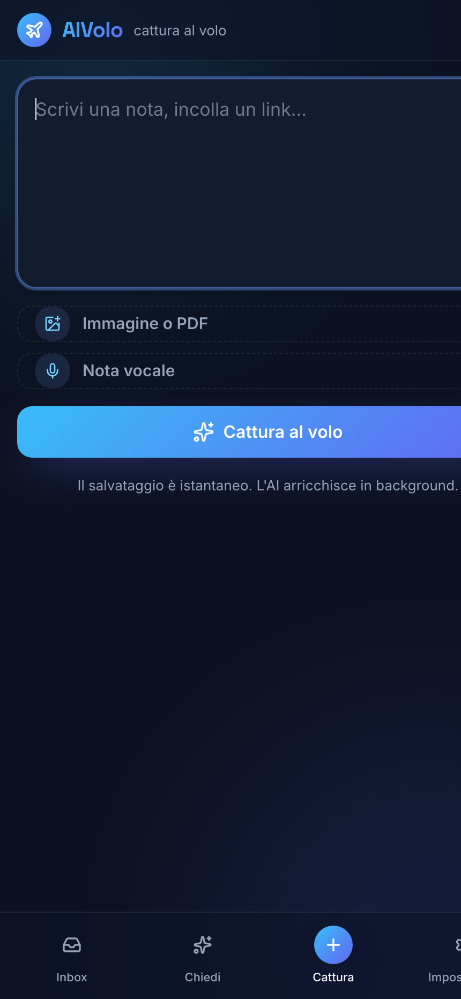
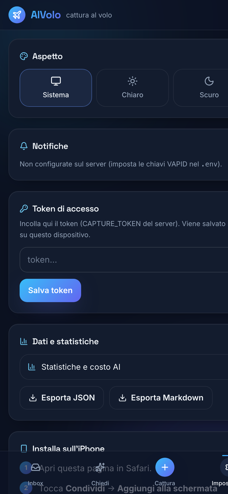

<div align="center">


# AlVolo ✈️

**Il tuo secondo cervello di cattura al volo.** Butti dentro testo, link, immagini, PDF e
note vocali con zero attrito; un'AI li **arricchisce in background** (titolo, riassunto,
tag, punti chiave, to‑do, elementi correlati) e poi puoi **chiederle qualsiasi cosa** sulla
tua inbox. Si usa come **app** su iPhone (PWA) e da PC, con **Shortcut iOS** ed
**estensione browser** per catturare ovunque. Tutto **self‑hosted**, dati tuoi.

</div>

## Screenshot

<table>
  <tr>
    <td align="center"><b>Inbox</b><br/></td>
    <td align="center"><b>Dettaglio</b><br/></td>
    <td align="center"><b>Chiedi (chat)</b><br/></td>
  </tr>
  <tr>
    <td align="center"><b>Statistiche</b><br/></td>
    <td align="center"><b>Cattura</b><br/></td>
    <td align="center"><b>Impostazioni</b><br/></td>
  </tr>
</table>

## Caratteristiche

**Cattura ovunque, al volo**
- ⚡ **Istantanea**: l'API risponde subito (202), l'AI lavora dopo. Testo, link, **immagini**, **PDF** e **note vocali**.
- 🔗 **Shortcut iOS** (menu Condividi) e 🧩 **estensione browser** (Chrome/Edge) per salvare pagine/selezioni dal desktop — vedi [`extension/`](extension/).
- 🎙️ **Voce → testo** locale (faster‑whisper, niente servizi esterni); 📄 **PDF** letti nativamente da Claude; 🖼️ **OCR** sulle immagini.

**Arricchimento & AI**
- 🧠 **Arricchimento** (Anthropic Claude): titolo, riassunto, categoria, tag, punti chiave, approfondimento, **to‑do** e **spunti correlati**.
- 🔗 **Grafo del secondo cervello**: gli elementi simili vengono collegati automaticamente ("Correlati").
- 💬 **Chiedi ad AlVolo**: chat che cerca tra le tue catture e risponde **con le fonti**; "Approfondisci" sul singolo elemento.
- 🗓️ **Recap della settimana** generato dall'AI.

**Organizza & ritrova**
- 🔎 **Ricerca** + filtri per stato/categoria/tag, **scroll infinito**.
- ✅ **Da fare**: i to‑do estratti dall'AI, spuntabili; vista dedicata.
- 🗂️ **Archivio**, ⏰ **Posticipa/Promemoria** ("In arrivo"), swipe per archiviare/eliminare con **Annulla**.

**App & realtime**
- 📱 **PWA installabile** (iPhone/desktop), 🌗 **tema chiaro/scuro** (iOS‑style o Aurora scuro).
- 🔴 **Live via SSE** (niente polling), 🔔 **notifiche Web Push** (opzionali), 📥 **cattura offline** con sync.

**Tu hai il controllo**
- 📊 **Statistiche + stima costi AI** (token già tracciati), 💾 **export** JSON/Markdown.
- 🏠 **Self‑hosted**: un solo container Docker, SQLite + file su volume.

## Come funziona

```
Cattura (PWA · Shortcut · estensione) ──POST /api/capture──▶ 202 immediato · item = "in coda"
                                                        │
                            worker asyncio in-process ◀─┘   (la tabella item È la coda)
                                  │ enrich con Claude (Opus immagini, Sonnet testo/link/PDF)
                                  │ voce → trascrizione locale (faster-whisper) → enrich
                                  ▼
                            item = "pronto"  ──SSE──▶ la PWA aggiorna la card in tempo reale
```

Lo stato vive nel DB (`capturing → processing → done/failed`), quindi sopravvive ai
riavvii; all'avvio gli item rimasti in `processing` vengono rimessi in coda. Senza chiave
Anthropic l'app usa un **arricchimento mock** (l'intero flusso funziona, solo i contenuti
AI sono placeholder).

## Stack

- **Backend**: Python 3.12 · FastAPI · SQLModel/SQLite (WAL) · worker asyncio in-process (niente broker) · SSE
- **AI**: Anthropic Claude — `claude-opus-4-8` (vision) e `claude-sonnet-4-6` (testo/link/PDF/chat), output strutturato · faster-whisper (voce, locale)
- **Frontend**: React 18 + Vite + TypeScript · Tailwind CSS v4 + shadcn/ui · icone Lucide · font Space Grotesk + Inter (self-hosted) · PWA (vite-plugin-pwa) · TanStack Query
- **Deploy**: un container Docker (frontend buildato dentro il backend), pensato per un VPS

---

## Sviluppo locale

Requisiti: Python 3.12, Node 20+.

**Backend**
```bash
cd backend
python3 -m venv .venv && source .venv/bin/activate
pip install -e ".[dev]"           # ".[dev]" include pytest (per i test)
cp ../.env.example .env            # opzionale: configura le variabili
DATA_DIR=./data alembic upgrade head
DATA_DIR=./data uvicorn app.main:app --reload --port 8000
```
Senza `ANTHROPIC_API_KEY` gira un **arricchimento mock**; senza `CAPTURE_TOKEN` l'**auth è
disabilitata** (solo dev). La voce richiede `faster-whisper` (incluso) e scarica il modello
al primo uso; le notifiche richiedono le chiavi `VAPID_*` (vedi sotto).

**Frontend**
```bash
cd frontend
npm install
npm run dev      # http://localhost:5173 (proxy /api -> http://127.0.0.1:8000)
```

**Test**
```bash
cd backend && source .venv/bin/activate && pytest
```

---

## Deploy sul VPS

Servono **Docker** + **Docker Compose** sul VPS, e un **dominio** (o sottodominio) puntato
all'IP del VPS — l'HTTPS è obbligatorio per la PWA, lo Shortcut iOS e le notifiche push.

**1. Clona e configura**
```bash
git clone https://github.com/micheleDibi/alvolo.git
cd alvolo
cp .env.example .env
# modifica .env: imposta ANTHROPIC_API_KEY e un CAPTURE_TOKEN
#   genera il token con: python3 -c "import secrets; print(secrets.token_urlsafe(32))"
# (opzionale) notifiche: npx web-push generate-vapid-keys -> VAPID_PUBLIC_KEY/PRIVATE_KEY
```

**2. Avvia l'app**
```bash
docker compose up -d --build
```
L'app gira su `127.0.0.1:8000`, con DB e file nel volume `alvolo_data` (persistente).
Per usare un'altra porta, imposta `APP_PORT` nel `.env`. Il container resta sempre sulla
8000 internamente.

> Se il reverse proxy gira su **un'altra macchina** (es. Nginx Proxy Manager sulla LAN),
> `127.0.0.1` non è raggiungibile da fuori: imposta `APP_BIND` nel `.env` con l'IP LAN
> dell'host (es. `APP_BIND=192.168.40.13`) o `0.0.0.0`, poi `docker compose up -d`.

**3. Reverse proxy + HTTPS** — scegli UNA delle due:

<details>
<summary><b>Caddy (consigliato — HTTPS automatico)</b></summary>

```bash
sudo apt install caddy
```
`/etc/caddy/Caddyfile`:
```
alvolo.tuodominio.com {
    reverse_proxy 127.0.0.1:8000
}
```
```bash
sudo systemctl reload caddy
```
Caddy ottiene e rinnova il certificato Let's Encrypt da solo.
</details>

<details>
<summary><b>nginx + certbot (se hai già nginx)</b></summary>

vhost:
```nginx
server {
    server_name alvolo.tuodominio.com;
    client_max_body_size 12m;          # immagini/PDF fino a ~10MB
    location / {
        proxy_pass http://127.0.0.1:8000;
        proxy_set_header Host $host;
        proxy_set_header Connection '';   # SSE: niente buffering
        proxy_buffering off;
    }
}
```
```bash
sudo certbot --nginx -d alvolo.tuodominio.com
```
</details>

**4. Aggiornamenti**
```bash
git pull && docker compose up -d --build
```

> ⚠️ **Una sola istanza** (`--workers 1`, già impostato nel Dockerfile): il worker
> in-process, SQLite e il bus SSE assumono un unico processo scrittore. Non scalare a più repliche.

**Backup**: il volume `alvolo_data` contiene tutto. Esempio:
`docker run --rm -v alvolo_data:/data -v $PWD:/b alpine tar czf /b/alvolo-backup.tgz -C /data .`
(oppure **Impostazioni → Esporta JSON/Markdown** dall'app.)

---

## iPhone & desktop

1. **iPhone**: apri il dominio in **Safari** → **Condividi** → **Aggiungi alla schermata Home**.
2. In **Impostazioni** della PWA incolla il `CAPTURE_TOKEN` (salvato solo sul dispositivo) e, se vuoi, attiva le **Notifiche**.
3. **Shortcut iOS**: seguilo da [`shortcut/AlVolo.md`](shortcut/AlVolo.md) → cattura dal menu **Condividi**.
4. **Estensione browser** (desktop): carica [`extension/`](extension/) da `chrome://extensions` (modalità sviluppatore) e imposta endpoint + token.

---

## Variabili d'ambiente

| Variabile | Default | Note |
|---|---|---|
| `ANTHROPIC_API_KEY` | _(vuoto)_ | vuoto ⇒ mock enrichment/chat |
| `OPUS_MODEL` | `claude-opus-4-8` | modello vision (immagini) |
| `SONNET_MODEL` | `claude-sonnet-4-6` | modello testo/link/PDF/chat |
| `CAPTURE_TOKEN` | _(vuoto)_ | vuoto ⇒ **auth disabilitata** (solo dev) |
| `DATA_DIR` | `./data` | DB + uploads; in Docker = `/data` (volume) |
| `WORKER_CONCURRENCY` | `2` | chiamate Claude in parallelo |
| `WHISPER_MODEL` | `base` | modello faster-whisper per la voce (tiny…large-v3) |
| `VAPID_PUBLIC_KEY` / `VAPID_PRIVATE_KEY` | _(vuoto)_ | Web Push; vuoto ⇒ notifiche disattivate. Genera con `npx web-push generate-vapid-keys` |
| `VAPID_SUBJECT` | `mailto:admin@example.com` | contatto VAPID |
| `APP_PORT` | `8000` | porta host pubblicata da docker compose |
| `APP_BIND` | `127.0.0.1` | interfaccia host del bind; IP LAN o `0.0.0.0` se il proxy è su un'altra macchina |

## Struttura del codice

```
backend/app/
  main.py     FastAPI: lifespan (DB + worker), router, static SPA, /api/health
  config.py · db.py · models.py · schemas.py · auth.py · storage.py · events.py · push.py · retrieval.py
  api/        capture · items (list/filtri/PATCH/meta) · ask (chat/digest) · stats · export · events (SSE) · push
  worker/     queue.py (loop + reminder sweep) · enrich.py (branch per tipo) · claude.py · extract.py · images.py · audio.py · relate.py
frontend/src/ React PWA · pagine (Inbox, ItemDetail, Capture, Ask, Stats, Settings) · components/ui (shadcn) · lib (auth, theme, push, offlineQueue) · design system in styles.css
extension/    estensione browser MV3 (popup + menu contestuale)
Dockerfile · docker-compose.yml · shortcut/AlVolo.md
```

## Percorsi di upgrade (non necessari ora)
Ricerca **FTS5/semantica** (oggi è LIKE token-based) · **email‑to‑inbox** · Postgres (codice SQLModel portabile) ·
object storage S3/R2 (layer `storage.py` astratto) · job broker.
